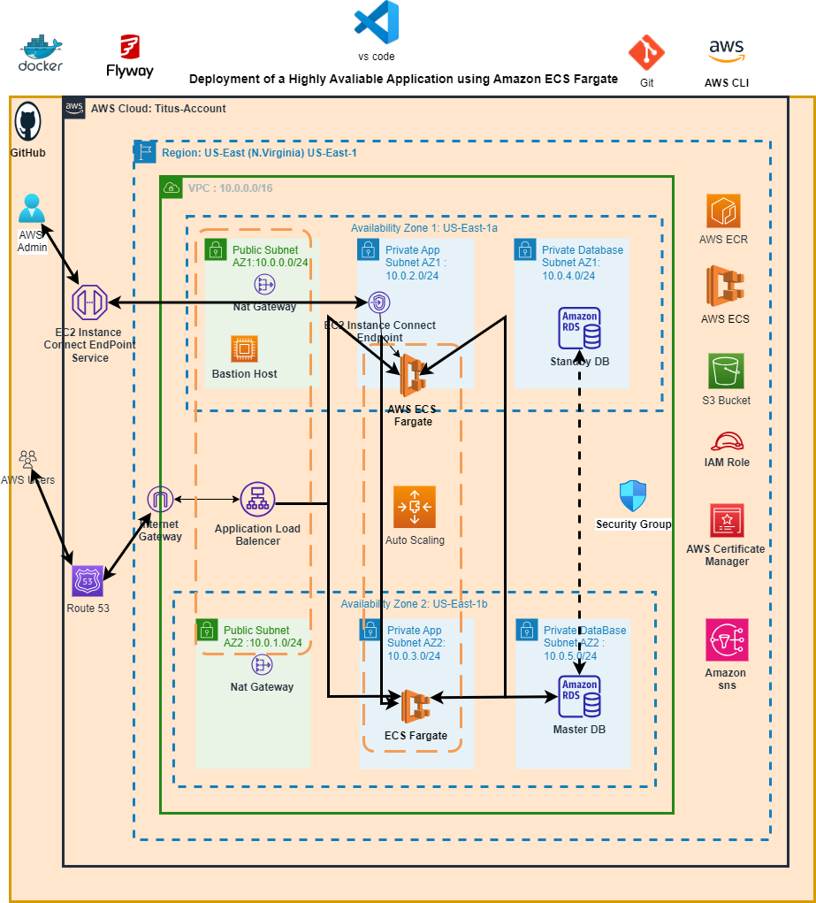

## Hosting a Dynamic E-commerce Web App on AWS with CI/CD Pipelines and GitHub Actions for ECS Fargate

### Overview

This DevOps project demonstrates the deployment of a dynamic e-commerce web app on AWS using CI/CD pipelines and GitHub Actions. The application is containerized using ECS Fargate, and various AWS services are leveraged for scalability, high availability, and security.

### Architecture




### AWS Resources Utilized

1. **Docker:**
   - Used to build the container image.

2. **Git and GitHub:**
   - Tracked changes to the source code and files, managing the Dockerfile and application codes.

3. **AWS CLI:**
   - Interacted with AWS services via the command line.

4. **Flyway:**
   - Used for database migration into the RDS database.

5. **VS Code:**
   - Used as the development environment to write and edit scripts.

6. **Amazon ECR:**
   - Stored the Docker image.

7. **Amazon ECS:**
   - Containerized the web application on AWS cloud.

8. **Three-tier VPC:**
   - Included public and private subnets in two availability zones.

9. **Internet Gateway:**
   - Allowed communication between resources in the VPC and the internet.

10. **NAT Gateways:**
    - Enabled resources in private subnets to access the internet.

11. **Amazon MySQL RDS:**
    - Used for the relational database.

12. **ECS Fargate:**
    - Ran the containerized application.

13. **Application Load Balancer:**
    - Distributed web traffic to ECS Fargate tasks.

14. **Auto Scaling Group:**
    - Dynamically created new ECS tasks.

15. **Route 53:**
    - Registered the domain name and created a record set.

16. **AWS S3:**
    - Stored files containing environment variables for the container.

17. **IAM Role:**
    - Granted permissions for ECS to execute tasks.

18. **Bastion Host:**
    - Used to set up an SSH tunnel.

19. **Security Groups:**
    - Controlled inbound and outbound traffic to resources.

20. **Certificate Manager:**
    - Encrypted data in transit.

### CI/CD - GitHub Actions

#### Prerequisites to Install before Running the Pipeline:

- Terraform
- Git
- GitHub
- VS Code (with Terraform extensions)
- Generated Keypairs & added the public key to GitHub
- AWS Command Line Interface (CLI) & configured AWS CLI profile

#### Setup AWS Account & Testing Terraform Code:

- Created a GitHub repo to store Terraform code.
- Cloned the repo on the computer.
- Updated the .gitignore file and added Terraform code to the repo.
- Created an S3 bucket to store Terraform code.
- Created a DynamoDB table to lock Terraform state.
- Created secrets in AWS Secret Manager.
- Registered a domain in Route 53.
- Updated the Terraform backend file with S3 and DynamoDB information.
- Created a tfvars file & updated its values.
- Ran `terraform apply` to test the code before creating a CI/CD pipeline.

#### Starting the CI/CD Pipeline:

- Created a personal access token that Docker will use to clone the application code repository during Docker image building.
- Created secrets in the GitHub repository.
- Created GitHub Action workflow files.
- Created GitHub Action jobs to:
  - Configure AWS credentials.
  - Deploy AWS infrastructure.
  - Destroy AWS infrastructure.
  - Create an ECR repository.
  - Self-hosted Runner (create an image from an EC2 instance with Docker & Git installed).
  - Build Docker image.
  - Create a repository to store the application.
  - Create Dockerfile and AppServiceProvider.php file.
  - Build and push Docker image to ECR.
  - Export environment variables to S3.
  - Created an SQL folder & added SQL script.
  - Migrate data into RDS database with Flyway.
  - Terminate the self-hosted runner in AWS console.
  - Create a job to stop the self-hosted runner.
  - Create a new ECS task definition revision.
  - Restart the ECS Fargate service.

### Scripts for Deploying the Web App on Amazon ECS Fargate

#### Install Necessary Software for the Application

```Dockerfile
# Use the latest version of the Amazon Linux base image
##Install the Necessary softwares for the application

# Use the latest version of the Amazon Linux base image
FROM amazonlinux:2

# Update all installed packages to thier latest versions
RUN yum update -y 

# Install the unzip package, which we will use it to extract the web files from the zip folder
RUN yum install unzip -y

# Install wget package, which we will use it to download files from the internet 
RUN yum install -y wget

# Install Apache
RUN yum install -y httpd

# Install PHP and various extensions
RUN amazon-linux-extras enable php7.4 && \
  yum clean metadata && \
  yum install -y \
    php \
    php-common \
    php-pear \
    php-cgi \
    php-curl \
    php-mbstring \
    php-gd \
    php-mysqlnd \
    php-gettext \
    php-json \
    php-xml \
    php-fpm \
    php-intl \
    php-zip

# Download the MySQL repository package
RUN wget https://repo.mysql.com/mysql80-community-release-el7-3.noarch.rpm

# Import the GPG key for the MySQL repository
RUN rpm --import https://repo.mysql.com/RPM-GPG-KEY-mysql-2022

# Install the MySQL repository package
RUN yum localinstall mysql80-community-release-el7-3.noarch.rpm -y

# Install the MySQL community server package
RUN yum install mysql-community-server -y

# Change directory to the html directory
WORKDIR /var/www/html

# Install Git
RUN yum install -y git

# Set the build argument directive
ARG PERSONAL_ACCESS_TOKEN
ARG GITHUB_USERNAME
ARG REPOSITORY_NAME
ARG WEB_FILE_ZIP
ARG WEB_FILE_UNZIP
ARG DOMAIN_NAME
ARG RDS_ENDPOINT
ARG RDS_DB_NAME
ARG RDS_DB_USERNAME
ARG RDS_DB_PASSWORD

# Use the build argument to set environment variables 
ENV PERSONAL_ACCESS_TOKEN=$PERSONAL_ACCESS_TOKEN 
ENV GITHUB_USERNAME=$GITHUB_USERNAME
ENV REPOSITORY_NAME=$REPOSITORY_NAME
ENV WEB_FILE_ZIP=$WEB_FILE_ZIP
ENV WEB_FILE_UNZIP=$WEB_FILE_UNZIP
ENV DOMAIN_NAME=$DOMAIN_NAME
ENV RDS_ENDPOINT=$RDS_ENDPOINT
ENV RDS_DB_NAME=$RDS_DB_NAME
ENV RDS_DB_USERNAME=$RDS_DB_USERNAME
ENV RDS_DB_PASSWORD=$RDS_DB_PASSWORD

# Clone the GitHub repository
RUN git clone https://${PERSONAL_ACCESS_TOKEN}@github.com/${GITHUB_USERNAME}/${REPOSITORY_NAME}.git

# Unzip the zip folder containing the web files
RUN unzip ${REPOSITORY_NAME}/${WEB_FILE_ZIP} -d ${REPOSITORY_NAME}/

# Copy the web files into the HTML directory
RUN cp -av ${REPOSITORY_NAME}/${WEB_FILE_UNZIP}/. /var/www/html

# Remove the repository we cloned
RUN rm -rf ${REPOSITORY_NAME}

# Enable the mod_rewrite setting in the httpd.conf file
RUN sed -i '/<Directory "\/var\/www\/html">/,/<\/Directory>/ s/AllowOverride None/AllowOverride All/' /etc/httpd/conf/httpd.conf

# Give full access to the /var/www/html directory
RUN chmod -R 777 /var/www/html

# Give full access to the storage directory
RUN chmod -R 777 storage/

# Use the sed command to search the .env file for a line that starts with APP_ENV= and replace everything after the = character
RUN sed -i '/^APP_ENV=/ s/=.*$/=production/' .env

# Use the sed command to search the .env file for a line that starts with APP_URL= and replace everything after the = character
RUN sed -i "/^APP_URL=/ s/=.*$/=https:\/\/${DOMAIN_NAME}\//" .env

# Use the sed command to search the .env file for a line that starts with DB_HOST= and replace everything after the = character
RUN sed -i "/^DB_HOST=/ s/=.*$/=${RDS_ENDPOINT}/" .env

# Use the sed command to search the .env file for a line that starts with DB_DATABASE= and replace everything after the = character
RUN sed -i "/^DB_DATABASE=/ s/=.*$/=${RDS_DB_NAME}/" .env

# Use the sed command to search the .env file for a line that starts with DB_USERNAME= and replace everything after the = character
RUN  sed -i "/^DB_USERNAME=/ s/=.*$/=${RDS_DB_USERNAME}/" .env

# Use the sed command to search the .env file for a line that starts with DB_PASSWORD= and replace everything after the = character
RUN  sed -i "/^DB_PASSWORD=/ s/=.*$/=${RDS_DB_PASSWORD}/" .env

# Print the .env file to review values
RUN cat .env

# Copy the file, AppServiceProvider.php from the host file system into the container at the path app/Providers/AppServiceProvider.php
COPY AppServiceProvider.php app/Providers/AppServiceProvider.php

# Expose the default Apache and MySQL ports
EXPOSE 80 3306

# Start Apache and MySQL
ENTRYPOINT ["/usr/sbin/httpd", "-D", "FOREGROUND"]


```

#### Migrate SQL Data to Amazon RDS

```bash
#!/bin/bash

# [Script Content...]
```

### Instructions for Use

1. **Clone the Repository:**
   - Clone this GitHub repository to your local machine.

2. **Configure AWS Resources:**
   - Use the provided architecture diagram and the AWS Management Console to set up the necessary resources.

3. **Update Scripts:**
   - Modify the scripts to include the correct configurations, such as AWS S3 bucket names, RDS endpoint, credentials, etc.

4. **Run the Scripts:**
   - Execute the scripts on your EC2 instance to deploy and configure the dynamic e-commerce web app.

5. **Access the Website:**
   - Once deployed, access the dynamic e-commerce website using the public DNS or IP address of the load balancer.
